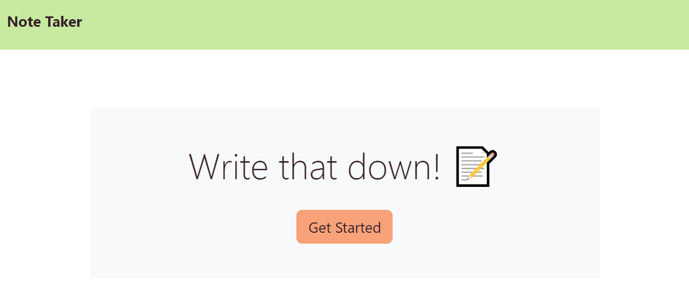
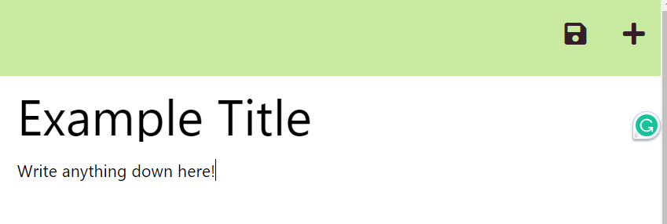
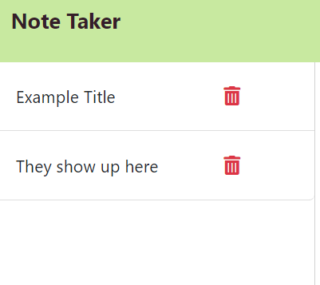

# Note Taker Application

## Table of Contents
1. [Description](#description)
2. [Installation](#installation)
3. [Usage](#usage)
4. [License](#license)
5. [Credits](#credits)

## Description
An application that allows the user to make notes or To-do lists, and save them to refer back to. Data persists until the user chooses to delete the note.

## Installation
No  installation is required, you can find the deployed  page here: https://blank-space.herokuapp.com/

## Usage
1. Click 'Get Started'
2. Click into 'Note Title' & type the title of your note
3. Click into 'Note Text' & type your note
4. To save your note, click the 'file' icon.
5. To delete note, click the 'trash can' icon.

## Screenshots

## License
MIT 

## Credits
Color Palette: https://coolors.co/6dd3ce-c8e9a0-f7a278-a13d63-351e29
